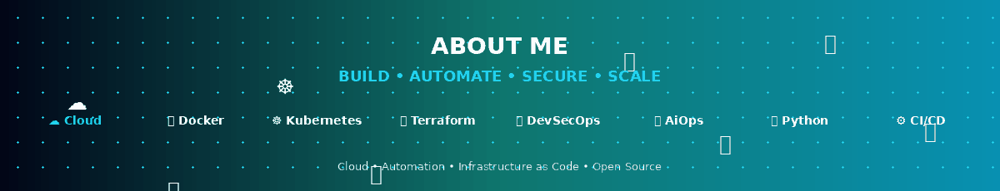
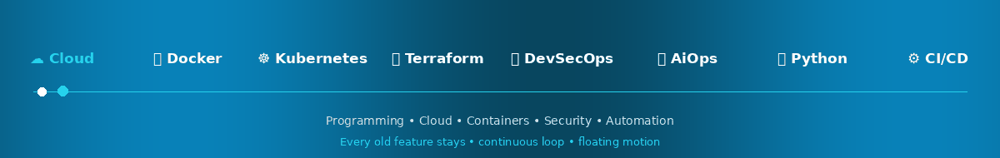
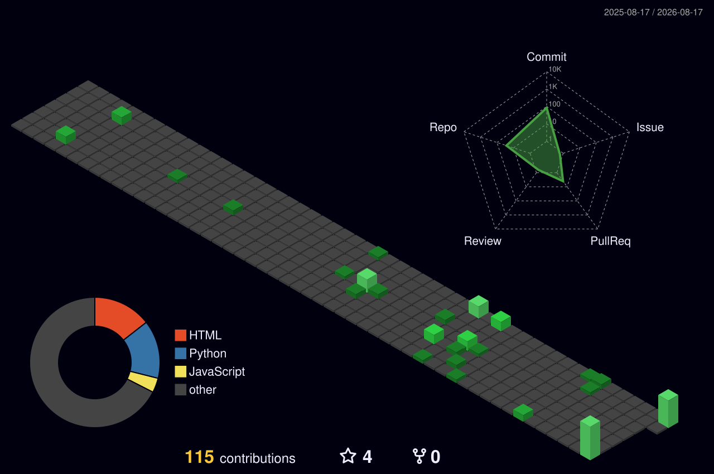

<!-- ===================== ANIMATED HEADER ===================== -->

  

<!-- ===================== TYPING ANIMATION ===================== -->

  

<!-- ===================== DEVOPS TOOLS ===================== -->

  

<!-- ===================== OPEN TO ===================== -->

  

<!-- ===================== SOCIAL ===================== -->

  
  &nbsp;
  

<!-- ===================== PROFILE STATS ===================== -->

  
  
  

<table align="center" width="100%">
<tr>
<td>

  

### 👋 Hi, I'm **Shiza Siddique**
**DevOps | Cloud | AiOps | DevSecOps | Automation Engineer**

I build and automate cloud infrastructure, design CI/CD pipelines, and explore the intersection of **AiOps**, **DevOps**, **DevSecOps**, and **Artificial Intelligence** to make deployments smarter, faster, and more secure.

  
  
  
  

**🚀 What I'm currently doing:**

  

| | |
|---|---|
| ☁️ | Building DevOps, Cloud & Automation projects |
| 🐳 | Working with Docker & containerized environments |
| ☸️ | Learning advanced Kubernetes concepts |
| 🏗️ | Exploring Terraform & Infrastructure as Code |
| 🔐 | Expanding knowledge in DevSecOps |
| 🤖 | Exploring **AiOps** — AI-driven DevOps automation |
| 🤝 | Open to Cloud, DevOps & Open-Source collaborations |

**📊 Skill Confidence**

  
  
  

  
  
  

  
  
  

**💡 Passionate about:**

  
  
  
  
  
  

</td>
</tr>
</table>

## 🛠️ Tech Stack

  

  
  
  
  
  

  
  
  
  
  

## 🏆 Achievements & Focus Areas

<table align="center" width="100%">
  <tr>
    <td width="25%" align="center">
      <h2>☁️</h2>
      <b>Cloud Engineering</b> 
      AWS · Azure 
      
    </td>
    <td width="25%" align="center">
      <h2>🐳</h2>
      <b>Containers</b> 
      Docker · Nginx 
      
    </td>
    <td width="25%" align="center">
      <h2>☸️</h2>
      <b>Orchestration</b> 
      Kubernetes 
      
    </td>
    <td width="25%" align="center">
      <h2>🔐</h2>
      <b>DevSecOps</b> 
      Security in CI/CD 
      
    </td>
  </tr>
</table>

## 🗺️ My DevOps Roadmap

```mermaid
graph LR
    A[🐧 Linux & Git] --> B[🐳 Docker]
    B --> C[☸️ Kubernetes]
    C --> D[🏗️ Terraform / IaC]
    D --> E[☁️ AWS & Azure]
    E --> F[⚙️ CI/CD Pipelines]
    F --> G[🔐 DevSecOps]
    G --> H[🤖 AiOps & AI-driven Automation]

    style A fill:#0d1117,stroke:#22D3EE,color:#ffffff
    style B fill:#0d1117,stroke:#22D3EE,color:#ffffff
    style C fill:#0d1117,stroke:#22D3EE,color:#ffffff
    style D fill:#0d1117,stroke:#22D3EE,color:#ffffff
    style E fill:#0d1117,stroke:#22D3EE,color:#ffffff
    style F fill:#0d1117,stroke:#22D3EE,color:#ffffff
    style G fill:#0d1117,stroke:#22D3EE,color:#ffffff
    style H fill:#0f766e,stroke:#22D3EE,color:#ffffff
```

## 📌 Pinned Projects

<!-- Replace the repository placeholders below with Shiza's actual GitHub repository names. -->

  
  

  
  

## 🏗️ What I'm Currently Working On

- ☁️ Building **DevOps, Cloud & Automation projects**
- 🐳 Working with **Docker and containerized environments**
- ☸️ Learning **Kubernetes** and advanced orchestration concepts
- 🏗️ Exploring **Terraform and Infrastructure as Code**
- 🔐 Learning **DevSecOps and secure deployment practices**
- 🚀 Strengthening skills across **AWS and Azure**
- 🤖 Exploring **AI-driven DevOps workflows**
- 🤝 Looking to collaborate on **Cloud, DevOps, AI & Open Source projects**

## ☁️ DevOps & Cloud Focus

I enjoy turning manual infrastructure and deployment tasks into **repeatable, automated, and scalable workflows**.

| Focus | What I Do |
|---|---|
| 🐳 Containers | Docker-based environments and application packaging |
| ☸️ Orchestration | Kubernetes deployment and container orchestration |
| ☁️ Cloud | AWS, Azure and cloud application deployment |
| ⚙️ Automation | CI/CD workflows, scripting and infrastructure automation |
| 🏗️ Infrastructure | Terraform, Linux and Infrastructure as Code concepts |
| 🔐 DevSecOps | Exploring security integration throughout the DevOps lifecycle |
| 🐍 Scripting | Python, PowerShell and automation scripting |
| 🎯 Mission | Eliminate repetitive work through automation and scalable infrastructure |

## 📊 GitHub Stats

  
  

  

  

  
  

  
  

## 📈 3D Contribution Graph

  

## 🐍 Contribution Snake

  <picture>
    <source media="(prefers-color-scheme: dark)" srcset="output/github-snake-dark.svg" />
    <source media="(prefers-color-scheme: light)" srcset="output/github-snake.svg" />
    
  </picture>

## 📬 Let's Connect

I'm interested in collaborations around **DevOps, Cloud Computing, Kubernetes, Automation, AI, DevSecOps, and Open Source**.

If you're building cloud infrastructure, automating deployments, or working on DevOps and open-source projects, feel free to reach out.

  &nbsp;
  

  <i>Fun fact: I love turning manual tasks into automated workflows! 🚀</i>

## 📡 Live Feed

  

  
  

 

  

⚡ Badges above update automatically in real time — no manual edits needed.

